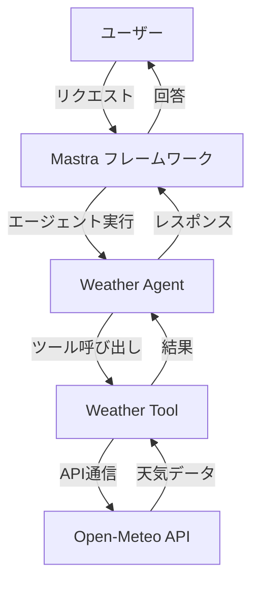
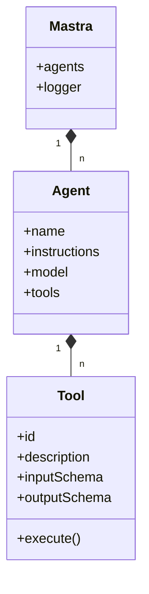

# MCP-MASTRA-APP プロジェクト概要

## はじめに

このドキュメントは、mcp-mastra-appプロジェクトに新規参画したメンバーが、プロジェクトの全体像を迅速かつ正確に把握できるよう作成されています。

## 目次

- [案件の概要](#案件の概要)
- [システム構成](#システム構成)
- [主要な機能とコンポーネント](#主要な機能とコンポーネント)
- [開発環境とセットアップ](#開発環境とセットアップ)
- [技術スタック](#技術スタック)
- [開発プロセス](#開発プロセス)

## 案件の概要

mcp-mastra-appは、Mastraフレームワークを使用したAIアシスタントアプリケーションです。このプロジェクトでは、天気情報を提供するAIエージェントが実装されており、ユーザーが特定の場所の天気情報を簡単に取得できるようになっています。

### 目的

- ユーザーが自然言語で天気情報をリクエストできるAIアシスタントの提供
- Mastraフレームワークの活用による効率的なAIエージェントの開発と運用

### 現状

現在のバージョンでは、天気情報を提供する基本的な機能が実装されています。ユーザーは特定の場所の天気情報をリクエストでき、AIエージェントが適切な情報を返します。

## システム構成

プロジェクトは以下のような構成になっています：



## 主要な機能とコンポーネント

### コンポーネント構成



### 主要コンポーネント詳細

1. **Mastra Core**
   - プロジェクトの中心となるフレームワーク
   - エージェントの管理と実行制御

2. **Weather Agent**
   - 天気情報の提供を担当するAIエージェント
   - Google Gemini-1.5-Proモデルを使用
   - 自然言語でのリクエストを処理

3. **Weather Tool**
   - Open-Meteo APIを使用して天気データを取得
   - 位置情報のジオコーディングと天気情報の取得
   - 気温、体感温度、湿度、風速などの情報を提供

## 開発環境とセットアップ

### 前提条件

- Node.jsとnpm（またはyarn）がインストールされていること
- Google AI APIキー（.env.developmentファイルに設定済み）

### 環境構築手順

1. リポジトリのクローン
   ```bash
   git clone [リポジトリURL]
   cd mcp-mastra-app
   ```

2. 依存関係のインストール
   ```bash
   npm install
   ```

3. 開発サーバーの起動
   ```bash
   npm run dev
   ```

## 技術スタック

### 主要依存関係

```json
{
  "dependencies": {
    "@ai-sdk/google": "^1.1.25",    // Google AI APIとの連携
    "@mastra/core": "^0.6.1",       // Mastraフレームワークのコア機能
    "@mastra/memory": "^0.2.2",     // エージェントの記憶機能
    "@mastra/rag": "^0.1.10",       // Retrieval-Augmented Generation機能
    "mastra": "^0.4.0",             // Mastraフレームワークのメインパッケージ
    "zod": "^3.24.2"                // スキーマ検証ライブラリ
  },
  "devDependencies": {
    "@types/node": "^22.13.10",     // Node.js型定義
    "tsx": "^4.19.3",               // TypeScriptの実行環境
    "typescript": "^5.8.2"          // TypeScriptコンパイラ
  }
}
```

### 使用技術

- **TypeScript**: 型安全なJavaScriptのスーパーセット
- **Mastra Framework**: AIエージェント開発フレームワーク
- **Google Gemini 1.5 Pro**: 大規模言語モデル
- **Open-Meteo API**: 天気情報の取得サービス
- **Zod**: スキーマ検証ライブラリ

## 開発プロセス

### コードの構成

プロジェクトのコード構造は以下の通りです：

```
mcp-mastra-app/
├── .env.development      // 開発環境用の環境変数
├── package.json          // プロジェクト設定と依存関係
├── tsconfig.json         // TypeScript設定
└── src/                  // ソースコード
    └── mastra/           // Mastraフレームワーク関連ファイル
        ├── index.ts      // アプリケーションのエントリーポイント
        ├── agents/       // AIエージェントの定義
        │   └── index.ts  // Weather Agentの実装
        └── tools/        // エージェントが使用するツール
            └── index.ts  // Weather Toolの実装
```

### 開発ワークフロー

1. 機能要件の定義
2. エージェントとツールの設計
3. 実装とテスト
4. コードレビュー
5. デプロイ

## トラブルシューティング

### よくある問題と解決方法

- **APIキーの問題**: .env.developmentファイルにGoogle AI APIキーが正しく設定されていることを確認
- **依存関係のエラー**: `npm install`を再実行して最新の依存関係をインストール

## 今後の展望

- 追加の天気関連機能（予報、アラートなど）の実装
- 他のドメイン（交通、ニュースなど）向けのエージェントの追加
- ユーザーインターフェースの改善

---

このドキュメントは、プロジェクトの進行に伴い随時更新されます。不明点や追加情報が必要な場合は、プロジェクト管理者にお問い合わせください。 